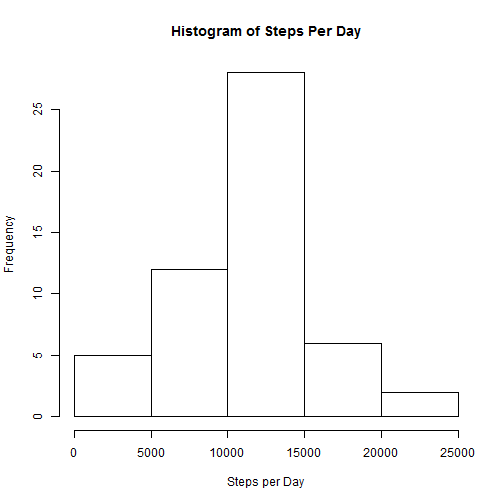
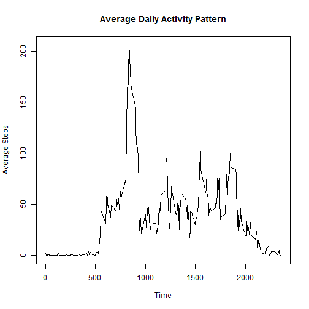
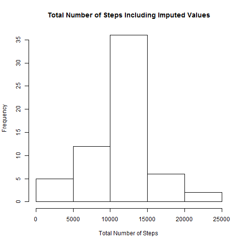
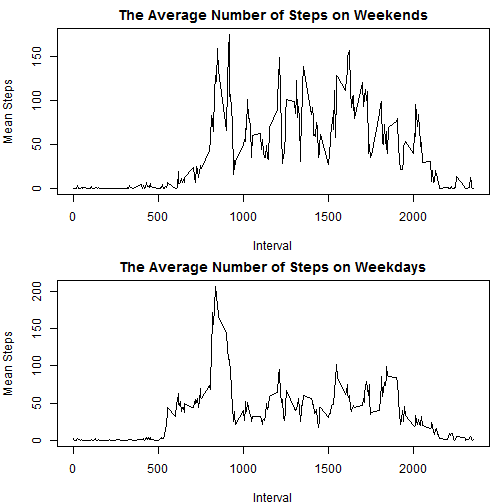

---
title: "Reproducible Research Peer Assessment Project #1"
output: html_document
   
---

by A. Brignole
(August 2015),
*Reproducible Research* - repdata-031,
Awesome Professor: Roger Peng, Ph.D.

**Introduction**

R Markdown is a simple formatting language that allows authors to prepare a report that documents and describes processed R code. The Week 2 assignment for the Coursera course *Reproducible Research* tasks students to create a report using R Markdown. 

The source data for the assignment lists a record of an individual's steps taken over five minute durations extending across a period of two months. The professor posited several questions about the data, expecting students to answer the questions in R with a report generated from an R Markdown file. This report answers the professor's questions. To promote reproducibility, the file generates output that offers the text, R code, and R output for peer review.


**Data**

The source of the data is here: 
[https://d396qusza40orc.cloudfront.net/repdata%2Fdata%2Factivity.zip](https://d396qusza40orc.cloudfront.net/repdata%2Fdata%2Factivity.zip). 

As described in the assignment, the dataset contains three variables: steps, interval, and date.  "Steps" is the number of steps taken in the 5 minute interval. "Interval" is the five minute increment during the date the data was collected, and "date" is the date of the interval was recorded.


**Part 1. Loading Packages, Importing the Data, and Preprocessing the Data**

Processing of the data required loading `dplyr` and `lubridate` R packages, which were previously installed into R. The code below called this package, suppressing the startup messages of dplyr.


```r
     library(lubridate)     
     suppressPackageStartupMessages(library(dplyr))
```


Next, the code read in the source data. The code presumes the user downloaded and decompressed the file in the user's working directory. See the previous section for the location and file name of the source data.


```r
  a1<-read.csv("activity.csv")
```

The source file contained NA's in the "steps"" variables.  For the purposes of this assignment, the code created two datasets - one without NA's and another with only NA's.  The two datafiles help to answer the professor's questions in later steps.


```r
  good<-complete.cases(a1)
  
  a2<-a1[good,]
  a3<-a1[!good,]
```

**Part 2. What is the Mean Total Number of Steps Taken per Day?**

*1. Calculate the total number of steps taken per day.*

*2. Make a histogram of the total number of steps taken each day.*

*3. Calculate and report the mean and median of the total number of steps taken per day.*

To answer this part, the dplyr function `group_by` grouped the data by days.  Then, the `summarize` function summed the steps for each day. A histogram, graphically displays the total number of steps taken each day. The `summary` statement lists standard descriptive statistics which includes the mean and median number of steps per day.  


```r
  grouped<- group_by(a2,date)
  b1<- summarize(grouped,sum(steps))
  colnames(b1)<- c("date", "steps")

  hist(b1$steps, main = "Histogram of Steps Per Day", xlab = "Steps per Day")
```

 

```r
  b3<-summary(b1$steps)
  print(b3)
```

```
##    Min. 1st Qu.  Median    Mean 3rd Qu.    Max. 
##      41    8841   10760   10770   13290   21190
```

**Part 3. What Is the Average Daily Activity Pattern?**

*1. Make a time series plot (i.e. type = "l") of the 5-minute interval (x-axis) and the average number of steps taken, averaged across all days (y-axis).*

For this question, the function `group_by` grouped the dataset according to unique values in the variable "interval".  Then, the `summarize` function computed the mean steps of each interval. A summary plot depicts the mean number of steps across daily intervals.


```r
    grouped2<- group_by(a2,interval)
    c1<-summarize(grouped2,mean(steps))
    
    colnames(c1)<- c("interval", "average")
    summary(c1$average)
```

```
##    Min. 1st Qu.  Median    Mean 3rd Qu.    Max. 
##   0.000   2.486  34.110  37.380  52.830 206.200
```

```r
    plot(c1$interval,c1$average, type = "l", main = "Average Daily Activity Pattern", xlab = "Time", ylab = "Average Steps")
```

 

*2. Which 5-minute interval, on average across all the days in the dataset, contains the maximum number of steps?*

The code below subseted the dataset, showing only the line where the maximum average number of steps occured.  The output exhibits both the maximum value and the interval .


```r
  c1[c1$average == max(c1$average),]
```

```
## Source: local data frame [1 x 2]
## 
##   interval  average
## 1      835 206.1698
```

**Part 4. Imputing Missing Values**

*1. Calculate and report the total number of missing values in the dataset (i.e. the total number of rows with NAs)*

The summary statement in R returns several values, among them is the number of NA's in the dataset.  The code below runs the `summary` statement on variable called "steps".


```r
  summary(a1$steps)
```

```
##    Min. 1st Qu.  Median    Mean 3rd Qu.    Max.    NA's 
##    0.00    0.00    0.00   37.38   12.00  806.00    2304
```

*2. Devise a strategy for filling in all of the missing values in the dataset. The strategy does not need to be sophisticated.*

The answer to Part 3 (above) determined the mean steps for each interval. Merging these calculated values into the dataset with missing values gives the mean value for each of the NA's with an identical interval. The code created a new dataset retaining only the columns with the date, imputed steps, and interval. Subsequently, the code renamed the columns to match those of the original data set. 


```r
  d1<-merge(a3,c1, by = "interval")
  d2<-d1[,c(1,3,4)]
  colnames(d2)<-c("interval", "date", "steps")
```

*3. Create a new dataset that is equal to the original dataset but with the missing data filled in.*

With the renamed columns, the `rbind` function appended the imputed datasets to the dataset without the NA's.


```r
  d2<-rbind(d2,a2)
```

*4. Make a histogram of the total number of steps taken each day and Calculate and report the mean and median total number of steps taken per day.*

The `group_by` function again grouped the dataset by days. The `sum` function called in the `summarize` function summed the steps of each day. A histogram plotted the summarized data. The function `summary` produced descriptive statistics such as the mean and median, which are clearly labeled.


```r
  grouped3<-group_by(d2,date)
  d3<-summarize(grouped3, sum(steps))
  colnames(d3)<-c("date", "steps")
  hist(d3$steps, main = "Total Number of Steps Including Imputed Values", xlab = "Total Number of Steps")
```

 

```r
  d4<-summary(d3$steps)
  print(d4)
```

```
##    Min. 1st Qu.  Median    Mean 3rd Qu.    Max. 
##      41    9819   10770   10770   12810   21190
```

*Do these values differ from the estimates from the first part of the assignment? What is the impact of imputing missing data on the estimates of the total daily number of steps?*

The code below combined the two summaries from the data without (b3) and with (d4) imputed values.  The imputed values raised the median, but did not change the mean.


```r
  d5<-rbind(b3,d4)
  print(d5)
```

```
##    Min. 1st Qu. Median  Mean 3rd Qu.  Max.
## b3   41    8841  10760 10770   13290 21190
## d4   41    9819  10770 10770   12810 21190
```

**Part 5.  Are there differences in activity patterns between weekdays and weekends?**

*1. Create a new factor variable in the dataset with two levels - "weekday" and "weekend" indicating whether a given date is a weekday or weekend day.*

Using the `weekdays` function, the day of the week became a new variable evaluated from the date.


```r
  a2$DayofWeek<-weekdays(ymd(a2$date), abbreviate = FALSE)
```

*2. Make a panel plot containing a time series plot (i.e. type = "l") of the 5-minute interval (x-axis) and the average number of steps taken, averaged across all weekday days or weekend days (y-axis). See the README file in the GitHub repository to see an example of what this plot should look like using simulated data.*

Prior to plotting, two datasets (e1 and e2) represented data from the weekend and weekday, respectively. Summarized data, employing the `group_by` and `mean` functions served as plottable data. The `par` code partitioned the plotting layout, while the `plot` function created the two graphs and inserted them into the designated plotting area.


```r
  e1<-a2[a2$DayofWeek == "Saturday"|a2$DayofWeek == "Sunday",]
  e2<-a2[a2$DayofWeek != "Saturday"|a2$DayofWeek != "Sunday",]
  e1a<-group_by(e1,interval)
  e1b<-summarize(e1a,mean(steps))
  colnames(e1b)<-c("interval", "steps")
  e2a<-group_by(e2, interval)
  e2b<-summarize(e2a,mean(steps))
  colnames(e2b)<-c("interval", "steps")

  par(mfrow = c(2,1), mar = c(4,4,2,1))
  plot(e1b$interval,e1b$steps, type = "l", main = "The Average Number of Steps on Weekends", xlab = "Interval", ylab = "Mean Steps")
  plot(e2b$interval,e2b$steps, type = "l", main = "The Average Number of Steps on Weekdays", xlab = "Interval", ylab = "Mean Steps")
```

 

This concludes the Week 2 assignment.
